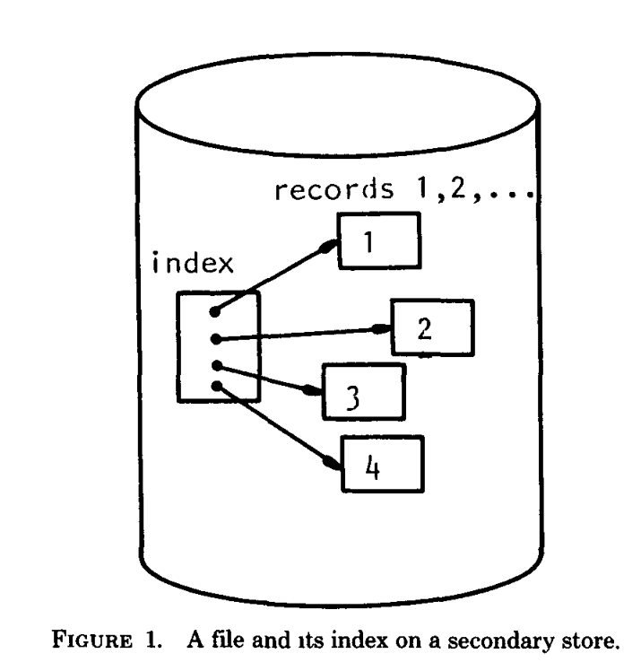

# The Ubiquitous B-Tree 无处不在的B树
Author: Douglas Comer       
Computer Sctence Department, Purdue Untverstty, West Lafayette, Indiana 47907

B-trees have become, de facto, a standard for file organization. File indexes of users,
dedicated database systems, and general-purpose access methods have all been proposed
and nnplemented using B-trees This paper reviews B-trees and shows why they have
been so successful It discusses the major variations of the B-tree, especially the B+-tree,
contrasting the relative merits and costs of each implementatmn. It illustrates a general
purpose access method which uses a B-tree.
Keywords and Phrases: B-tree, B*-tree, B+-tree, file organization, index
CR Categorws: 3.73 3.74 4.33 4 34

B树已经成为事实上的文件组织的标准。用户的文件索引、专用的数据库系统和所有建议及已补充的使用B树作为通用访问方法的。
这篇论文回顾B树为什么获得了如此的成功，它讨论B树的一些主要变体，特别是B+树，对照每一种实现相关的价值和代价。
它说明了使用B树的通用访问方法。

关键词和短语：B树、B*树、B+树、文件组织、索引   

INTRODUCTION    介绍        
Operations on a File    操作一个文件        
1 THE BASIC B-TREE  基础的B树       
    Balancing   平衡        
    Insertion   插入        
    Deletion    删除        
2 THE COST OF OPERATIONS    操作的花费      
    Retrieval Costs     检索的开销      
    Insertion and Deletion Costs    插入和删除的开销        
    Sequential  Processing 顺序处理     
3 B-TREE VARIANTS   B树变体         
    B*-Trees    B*树             
    B+-Trees    B+树    
    Prefix B+-Trees     前缀B+树    
    Virtual B-Trees     虚拟B树         
    Compression    压缩      
    Variable Length Entries    可变宽度入口      
    Binary B-Trees      二叉B树      
    2-3 Trees and Theoretical Results    2-3树和理论结果    
4 B-TREES IN A MULTIUSER ENVIRONMENT     B树在多用户环境       
    Security    安全            
5 A GENERAL PURPOSE ACCESS METHOD USING    通用访问方法的使用          
    B+-TREES     B+树    
    Performance Enhancements      优化性能        
    Tree-Structured File Directory      树结构文件目录             
    Other VSAM Facilities     
SUMMARY     摘要          
ACKNOWLEDGMENTS     致谢           
REFERENCES     参考引用      

# Introduction
The secondary storage facilities available on large computer systems allow users to store, 
update, and recall data from large collections of information called files. A computer must 
retrieve an item and place it in main memory before it can be processed. In order to make 
good use of the computer resources, one must organize files intelligently, making the retrieval 
process efficient.

在大型计算机系统上可用的辅助存储设备允许用户存储、更新、记忆来自被称作文件的大型集合信息的数据。
计算机必须检索一个项并且放置在主存中，然后它才能被处理。为了更好地使用计算机资源，必须聪明地组织文件，
让它能够被高效地检索。

The choice of a good file organization depends on the kinds of retrieval to be performed. 
There are two broad classes of retrieval commands which can be illustrated by the following examples:
Sequential: "From our employee file, prepare a list of all employees names and addresses," and      
Random: "From our employee file, extract the information about employee J. Smith".      

一个好的文件架构依赖着一种执行的检索。这里有两类广泛的检索命令，能够通过下面的示例进行说明。
按次序检索：从我们的职员文件，预处理一个所有职员名字和地址的列表。      
随机检索：从我们的职员文件，提取关于职员J. Smith的信息。        

We can imagine a filing cabinet with three drawers of folders, one folder for each employee. 
The drawers might be labeled "A-G," "H-R," and "S-Z," while the folders might be labeled with 
the employees' last names. A sequential request requires the searcher to examine the entire file, 
one folder at a time. On the other hand, a random request implies that the searcher, guided by 
the labels on the drawers and folders, need only extract one folder.

我们能想象成有三个文件抽屉的文件储藏柜，一个文件夹存储一个职员。这些戳提的标签可能是“A-G”、“H-R”和“S-Z”，
在此同时文件夹可能有着职员名字的标签。文件夹在一段时间内，一个顺序请求要求搜索者仔细检查全部的文件。另一种方式，
一个随机请求暗示搜索者，通过标签的指南在抽屉和文件夹中，仅仅提取所需要的一个文件夹。    

Associated with a large, randomly accessed file in a computer system is an index which, like the 
labels on the drawers and folders of the file cabinet, speeds retrieval by directing the searcher 
to the small part of the file containing the desired item. Figure 1 depicts a file and its index. 
An index may be physically integrated with the file, like the labels on employee folders, or phys-
ically separate, like the labels on the drawers. Usually the index itself is a file. If the index 
file is large, another index may be built on top of it to speed retrieval further, and so on. The 
resulting hierarchy is similar to the employee file, where the topmost index consists of labels on 
drawers, and the next level of index consists of labels on folders.

在一个计算机系统里使一个巨大的文件能够随机访问的是索引，像在文件存储柜的抽屉和文件夹上的标签一样，通过直接让搜索者
搜索包含所需部分的一小部分文件来加速检索。图1描绘了一个文件和它的索引。一个索引可能是物理集成在文件里的，像在职员
文件夹的标签一样，或者物理分离的，像在抽屉上的标签。通常索引它本身是一个文件。如果索引文件很大，另一个索引可能构建
在它上面用来加速未来的检索，等等。检索结果是有层次的类似职员文件，由在抽屉上的标签的顶部索引组成，和文件夹上的标签
组成的索引为下一个等级。

Natural hierarchies, like the one formed by considering last names as index entries, do not always 
produce the best performance when used in a computer system. Usually, a unique key is assigned to 
each item in the file, and all retrieval is requested by specifying the key. For example, each employee 
might be assigned a unique employee number which would identify that employee's record. Instead of 
labeling the drawers of the cabinet "A-G," etc., one would use ranges of employee numbers like "0001"-"3000".

自然的层次，像通过考虑把名字作为索引的整个，在计算机系统里这样使用不能总是获得最好的性能。通常，一个唯一的键分配给在
文件的一个项，而且所有的检索都要求指定这个键。例如，在标记职员记录的时候，每个职员可能被分配了唯一的职员号码。替代
在存储柜的抽屉上进行标签"A-G"等等，一个可能使用的职员号码范围是 "0001"-"3000"。

Many techniques for organizing a file and its index have been proposed; Knuth [KNuT73] provides a survey 
of the basics.  While no single scheme can be optimum for all applications, the technique of organizing 
a file and its index called the B-tree has become widely used. The B-tree is, de facto, the standard 
organization for indexes in a database system. This paper, intended for computer professionals who have 
heard of B-trees and want some explanation or direction for further reading, compares several variations 
of the B-tree, especially the B+-tree, showing why it has become popular. It surveys the literature on B-trees 
including recent papers not mentioned in textbooks. In addition, it discusses a general purpose file access 
method based on the Btree.

很多组织文件和它的索引的技术被提议，Kunth [KNUT73] 提供了一个基础的概述。虽然没有一个单一的规划能够适应所有的应用，
这个组织文件和索引的技术叫做B树，已经被广泛地使用了。B树是在数据库组织索引的事实标准。这个论文试图为有知道
B树和想更进一步地阐述或者直接为未来的阅读的计算机专业人士，比较各种B树的变体，尤其是B+树，表明它为什么会成为受欢迎的。
这篇论文罗列了B树相关的最近的论文没有提及的著作。

The starting point of our discussion is an internal storage structure called the binary search tree. 
In particular, we begin with balanced binary search trees because of their guaranteed low retrieval cost. 
For a survey of binary search trees and other internal storage mechanisms, the reader is referred to SEVE74 
and NIEV74. NIEV74 also explains the graph theoretic terms "tree," "node," "edge," "root," "path," and "leaf," 
which will be used throughout the discussion.  The remainder of this Introduction presents a model of the 
retrieval process and outlines the file operations to be considered.  Section 1 presents the basic B-tree as 
proposed by Bayer and McCreight, giving the methods for inserting, deleting, and locating items. Then for 
each type of operation, Section 2 examines the cost and concludes that sequential processing can be expensive. 
In many cases, changes in implementation can lower the costs; Section 3 shows variations of the B-tree 
which have been developed to do so. Extending the variations of B-trees, Section 4 reviews the problems 
of maintaining a B-tree in a multiple user environment and outlines solutions for concurrency and security problems. Finally, Section 5 presents IBM's general purpose file access method which is based on the B-tree.

我们讨论的一开始的点是一个叫做二叉搜素树的内存结构。特别地，我们从平衡二叉搜索树开始，疑问它能保证检索的低开销。
为了概述二叉搜索树和其他的内存机制，读者需要查阅 SEVE74和NIEV74 论文。NIEV74 论文详细解释了图论的术语 树、节点、边、
根、路径和叶子，这些术语将会被整个讨论中使用。这个介绍的余下部分将描述检索处理和文件操作大纲的模型。第一部分将描述Bayer
和McCreight提议的基础B树，给了插入、删除和定位项的方法。然后为每个类型的操作；第二部分详细描述这些操作的开销和顺序
处理之所昂贵的推断。在很多情况下，改变实现能够降低开销；第三部分展示了已经开发使用的B树变体。延伸描述B树的变体，第四部分
审核在多用户环境下维护B树的问题和解决安全、并发问题的大纲解决方案。最后，第五部分描述了IBM基于B树结构基础的通用文件访问方法。

# Operations on a File 文件的操作
For purposes of this paper, we think of a file as a set of n records, each of the form ri = (ki, ai), 
in which k*i* is called the key for the *i*th record, and a*i* the associated information. For example, the key 
for a record in an employee file might be a five-digit employee number, while the associated information 
might consist of the employee's name, address, salary, and number of dependents.

We assume that key k*i* uniquely identifies record r*i*. Furthermore, we assume that although the key is much 
shorter than the associated information, the set of all keys is too large to fit into main memory. These
assumptions imply that if records are to be retrieved randomly using the keys, it would be advantageous to 
construct an index to speed retrieval. Since the set of all keys does not fit in main memory, the index
itself must be external. Finally, we assume that the keys have a natural order, say alphabetical, so we can 
refer to the keysequence order of a file.

Users conduct transactions against a file, inserting, deleting, retrieving, and updating records. In 
additions, users frequently process the file sequentially, in key-sequence order, starting at a given point. 
Most often, that starting point is the beginning of the file. A set of basic operations which support
such transactions are:
insert: add a new record, (ki, ai), checking that k, is unique,      
delete: remove record (ki, a1) given k,,     
find: retrieve a~i+1 given ki,     
next: retrieve a~i+1 given that a, was just retrieved (i.e., process the file sequentially).

For a given file organization, there are costs associated with maintaining the index and with performing 
each of these operations. Since the index is intended to speed retrieval, processing time is usually taken
as the primary cost measure. With current hardware technology, the time required to access secondary storage 
is the main component of the total time required to process the data. Furthermore, most random access
devices transfer a fixed amount of data per read operation, so that the total time required is linearly 
related to the number of reads. Therefore, the number of secondary storage accesses serves as a reasonable 
cost measure for evaluating index methods.  Other less important costs include the time to process data 
once it has been placed in main memory, the secondary storage space utilization, and the ratio of the space 
required by the index to the space required by the associated information.