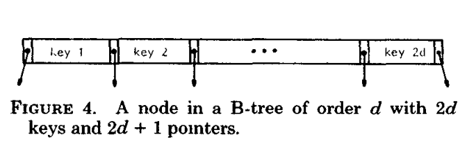
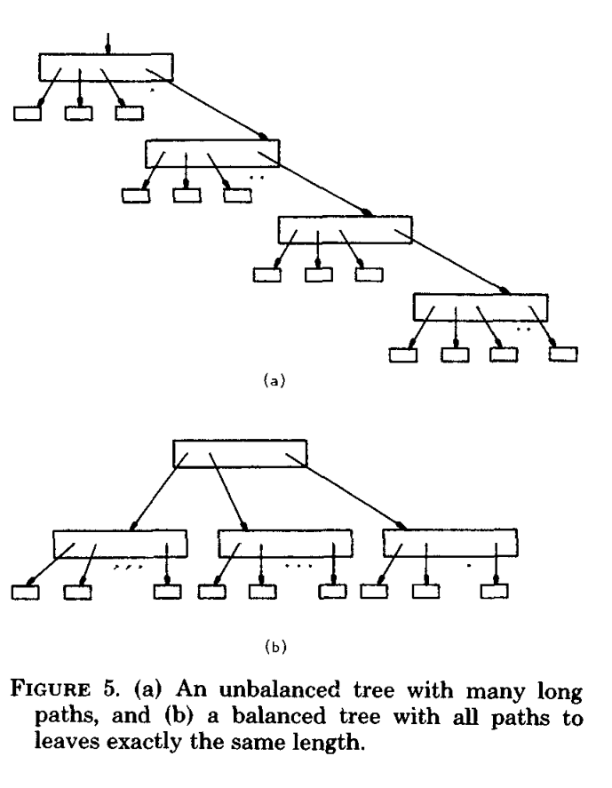
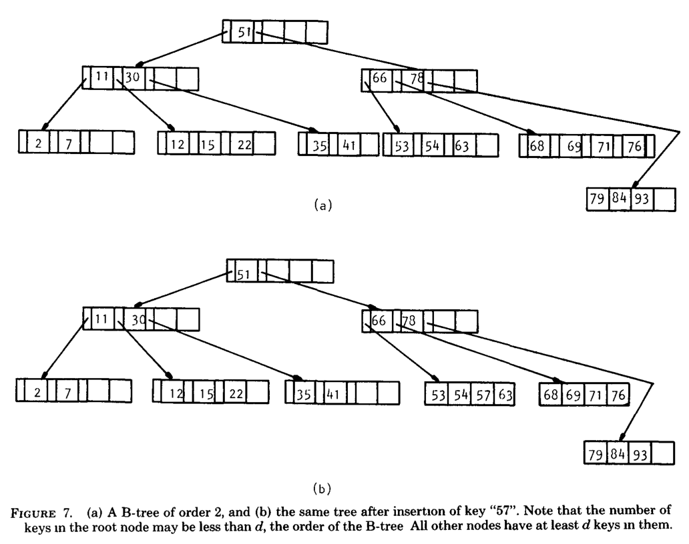

这篇论文篇幅太长，很多长难句，如果粗糙地忽略过就达不到训练自己的目的，精准地达成目的才是我要的。    
所以先粗略地翻译一遍，然后第二篇来审校，确定哪些句子有问题。

# The Ubiquitous B-Tree 无处不在的B树
Author: Douglas Comer       
Computer Sctence Department, Purdue Untverstty, West Lafayette, Indiana 47907

B-trees have become, de facto, a standard for file organization. File indexes of users,
dedicated database systems, and general-purpose access methods have all been proposed
and nnplemented using B-trees This paper reviews B-trees and shows why they have
been so successful It discusses the major variations of the B-tree, especially the B+-tree,
contrasting the relative merits and costs of each implementatmn. It illustrates a general
purpose access method which uses a B-tree.
Keywords and Phrases: B-tree, B*-tree, B+-tree, file organization, index
CR Categorws: 3.73 3.74 4.33 4 34

B树已经成为事实上的文件组织的标准。用户的文件索引、专用的数据库系统和所有建议及已补充的使用B树作为通用访问方法的。
这篇论文回顾B树为什么获得了如此的成功，它讨论B树的一些主要变体，特别是B+树，对照每一种实现相关的价值和代价。
它说明了使用B树的通用访问方法。

关键词和短语：B树、B*树、B+树、文件组织、索引   

INTRODUCTION    介绍        
Operations on a File    操作一个文件        
1 THE BASIC B-TREE  基础的B树       
    Balancing   平衡        
    Insertion   插入        
    Deletion    删除        
2 THE COST OF OPERATIONS    操作的花费      
    Retrieval Costs     检索的开销      
    Insertion and Deletion Costs    插入和删除的开销        
    Sequential  Processing 顺序处理     
3 B-TREE VARIANTS   B树变体         
    B*-Trees    B*树             
    B+-Trees    B+树    
    Prefix B+-Trees     前缀B+树    
    Virtual B-Trees     虚拟B树         
    Compression    压缩      
    Variable Length Entries    可变宽度入口      
    Binary B-Trees      二叉B树      
    2-3 Trees and Theoretical Results    2-3树和理论结果    
4 B-TREES IN A MULTIUSER ENVIRONMENT     B树在多用户环境       
    Security    安全            
5 A GENERAL PURPOSE ACCESS METHOD USING    通用访问方法的使用          
    B+-TREES     B+树    
    Performance Enhancements      优化性能        
    Tree-Structured File Directory      树结构文件目录             
    Other VSAM Facilities     
SUMMARY     摘要          
ACKNOWLEDGMENTS     致谢           
REFERENCES     参考引用      

# Introduction
The secondary storage facilities available on large computer systems allow users to store, 
update, and recall data from large collections of information called files. A computer must 
retrieve an item and place it in main memory before it can be processed. In order to make 
good use of the computer resources, one must organize files intelligently, making the retrieval 
process efficient.

在大型计算机系统上可用的辅助存储设备允许用户存储、更新、记忆来自被称作文件的大型集合信息的数据。
计算机必须检索一个项并且放置在主存中，然后它才能被处理。为了更好地使用计算机资源，必须聪明地组织文件，
让它能够被高效地检索。

The choice of a good file organization depends on the kinds of retrieval to be performed. 
There are two broad classes of retrieval commands which can be illustrated by the following examples:
Sequential: "From our employee file, prepare a list of all employees names and addresses," and      
Random: "From our employee file, extract the information about employee J. Smith".      

一个好的文件架构依赖着一种执行的检索。这里有两类广泛的检索命令，能够通过下面的示例进行说明。
按次序检索：从我们的职员文件，预处理一个所有职员名字和地址的列表。      
随机检索：从我们的职员文件，提取关于职员J. Smith的信息。        

We can imagine a filing cabinet with three drawers of folders, one folder for each employee. 
The drawers might be labeled "A-G," "H-R," and "S-Z," while the folders might be labeled with 
the employees' last names. A sequential request requires the searcher to examine the entire file, 
one folder at a time. On the other hand, a random request implies that the searcher, guided by 
the labels on the drawers and folders, need only extract one folder.

我们能想象成有三个文件抽屉的文件储藏柜，一个文件夹存储一个职员。这些戳提的标签可能是“A-G”、“H-R”和“S-Z”，
在此同时文件夹可能有着职员名字的标签。文件夹在一段时间内，一个顺序请求要求搜索者仔细检查全部的文件。另一种方式，
一个随机请求暗示搜索者，通过标签的指南在抽屉和文件夹中，仅仅提取所需要的一个文件夹。    

Associated with a large, randomly accessed file in a computer system is an index which, like the 
labels on the drawers and folders of the file cabinet, speeds retrieval by directing the searcher 
to the small part of the file containing the desired item. Figure 1 depicts a file and its index. 
An index may be physically integrated with the file, like the labels on employee folders, or phys-
ically separate, like the labels on the drawers. Usually the index itself is a file. If the index 
file is large, another index may be built on top of it to speed retrieval further, and so on. The 
resulting hierarchy is similar to the employee file, where the topmost index consists of labels on 
drawers, and the next level of index consists of labels on folders.

在一个计算机系统里使一个巨大的文件能够随机访问的是索引，像在文件存储柜的抽屉和文件夹上的标签一样，通过直接让搜索者
搜索包含所需部分的一小部分文件来加速检索。图1描绘了一个文件和它的索引。一个索引可能是物理集成在文件里的，像在职员
文件夹的标签一样，或者物理分离的，像在抽屉上的标签。通常索引它本身是一个文件。如果索引文件很大，另一个索引可能构建
在它上面用来加速未来的检索，等等。检索结果是有层次的类似职员文件，由在抽屉上的标签的顶部索引组成，和文件夹上的标签
组成的索引为下一个等级。

Natural hierarchies, like the one formed by considering last names as index entries, do not always 
produce the best performance when used in a computer system. Usually, a unique key is assigned to 
each item in the file, and all retrieval is requested by specifying the key. For example, each employee 
might be assigned a unique employee number which would identify that employee's record. Instead of 
labeling the drawers of the cabinet "A-G," etc., one would use ranges of employee numbers like "0001"-"3000".

自然的层次，像通过考虑把名字作为索引的整个，在计算机系统里这样使用不能总是获得最好的性能。通常，一个唯一的键分配给在
文件的一个项，而且所有的检索都要求指定这个键。例如，在标记职员记录的时候，每个职员可能被分配了唯一的职员号码。替代
在存储柜的抽屉上进行标签"A-G"等等，一个可能使用的职员号码范围是 "0001"-"3000"。

Many techniques for organizing a file and its index have been proposed; Knuth [KNuT73] provides a survey 
of the basics.  While no single scheme can be optimum for all applications, the technique of organizing 
a file and its index called the B-tree has become widely used. The B-tree is, de facto, the standard 
organization for indexes in a database system. This paper, intended for computer professionals who have 
heard of B-trees and want some explanation or direction for further reading, compares several variations 
of the B-tree, especially the B+-tree, showing why it has become popular. It surveys the literature on B-trees 
including recent papers not mentioned in textbooks. In addition, it discusses a general purpose file access 
method based on the Btree.

很多组织文件和它的索引的技术被提议，Kunth [KNUT73] 提供了一个基础的概述。虽然没有一个单一的规划能够适应所有的应用，
这个组织文件和索引的技术叫做B树，已经被广泛地使用了。B树是在数据库组织索引的事实标准。这个论文试图为有知道
B树和想更进一步地阐述或者直接为未来的阅读的计算机专业人士，比较各种B树的变体，尤其是B+树，表明它为什么会成为受欢迎的。
这篇论文罗列了B树相关的最近的论文没有提及的著作。

The starting point of our discussion is an internal storage structure called the binary search tree. 
In particular, we begin with balanced binary search trees because of their guaranteed low retrieval cost. 
For a survey of binary search trees and other internal storage mechanisms, the reader is referred to SEVE74 
and NIEV74. NIEV74 also explains the graph theoretic terms "tree," "node," "edge," "root," "path," and "leaf," 
which will be used throughout the discussion.  The remainder of this Introduction presents a model of the 
retrieval process and outlines the file operations to be considered.  Section 1 presents the basic B-tree as 
proposed by Bayer and McCreight, giving the methods for inserting, deleting, and locating items. Then for 
each type of operation, Section 2 examines the cost and concludes that sequential processing can be expensive. 
In many cases, changes in implementation can lower the costs; Section 3 shows variations of the B-tree 
which have been developed to do so. Extending the variations of B-trees, Section 4 reviews the problems 
of maintaining a B-tree in a multiple user environment and outlines solutions for concurrency and security problems. Finally, Section 5 presents IBM's general purpose file access method which is based on the B-tree.

我们讨论的一开始的点是一个叫做二叉搜素树的内存结构。特别地，我们从平衡二叉搜索树开始，疑问它能保证检索的低开销。
为了概述二叉搜索树和其他的内存机制，读者需要查阅 SEVE74和NIEV74 论文。NIEV74 论文详细解释了图论的术语 树、节点、边、
根、路径和叶子，这些术语将会被整个讨论中使用。这个介绍的余下部分将描述检索处理和文件操作大纲的模型。第一部分将描述Bayer
和McCreight提议的基础B树，给了插入、删除和定位项的方法。然后为每个类型的操作；第二部分详细描述这些操作的开销和顺序
处理之所昂贵的推断。在很多情况下，改变实现能够降低开销；第三部分展示了已经开发使用的B树变体。延伸描述B树的变体，第四部分
审核在多用户环境下维护B树的问题和解决安全、并发问题的大纲解决方案。最后，第五部分描述了IBM基于B树结构基础的通用文件访问方法。

# Operations on a File 文件的操作
For purposes of this paper, we think of a file as a set of n records, each of the form ri = (ki, ai), 
in which k*i* is called the key for the *i*th record, and a*i* the associated information. For example, the key 
for a record in an employee file might be a five-digit employee number, while the associated information 
might consist of the employee's name, address, salary, and number of dependents.

由于这篇论文的目的，我们把一个文件看做n条记录的集合，每一个记录用 `ri = (ki, ai)` 表示，其中 ki 是第i条记录的键，ai表示关联的信息。
例如，一条记录的键可能是职员文件中的五位数职员号码，而关联的信息可能是由职员姓名、地址、薪水和职员编号组成的。

We assume that key k*i* uniquely identifies record r*i*. Furthermore, we assume that although the key is much 
shorter than the associated information, the set of all keys is too large to fit into main memory. These
assumptions imply that if records are to be retrieved randomly using the keys, it would be advantageous to 
construct an index to speed retrieval. Since the set of all keys does not fit in main memory, the index
itself must be external. Finally, we assume that the keys have a natural order, say alphabetical, so we can 
refer to the keysequence order of a file.

我们假设键 ki 是记录 ri 的唯一标识符。此外，我们假设尽管这些键比关联的信息更短，但是所有键的集合是非常巨大的，会填满整个内存。
我们假定这些记录使用键来进行随机访问，使用索引的优点是提高检索速度。一开始所有键的集合并不会填满内存，但是这些索引一定会扩展。
最终，我们假设这些键有一个自然的顺序，叫做字母顺序，所以我们能引用关键序列的文件。           

Users conduct transactions against a file, inserting, deleting, retrieving, and updating records. In 
additions, users frequently process the file sequentially, in key-sequence order, starting at a given point. 
Most often, that starting point is the beginning of the file. A set of basic operations which support
such transactions are:
insert: add a new record, (ki, ai), checking that ki, is unique,      
delete: remove record (ki, ai) given ki,     
find: retrieve ai given ki,     
next: retrieve a~i+1 given that ai, was just retrieved (i.e., process the file sequentially).

用户对文件进行组织事务，插入、删除、检索和更新记录。更多的，用户频繁处理文件排序，通过键排序，给一个开始的指针。
常常地，这个起点是文件的开始。一个基础操作的集合支持如下的事务：
插入：添加一个新的记录，(ki, ai)，检测这个k是唯一的。
删除：通过给的键ki移除记录(ki, ai)
查找：通过给的键ki检索值ai
下一个：根据给的文件ai检索下一个a~i+1（顺序地处理文件序列）

For a given file organization, there are costs associated with maintaining the index and with performing 
each of these operations. Since the index is intended to speed retrieval, processing time is usually taken
as the primary cost measure. With current hardware technology, the time required to access secondary storage 
is the main component of the total time required to process the data. Furthermore, most random access
devices transfer a fixed amount of data per read operation, so that the total time required is linearly 
related to the number of reads. Therefore, the number of secondary storage accesses serves as a reasonable 
cost measure for evaluating index methods.  Other less important costs include the time to process data 
once it has been placed in main memory, the secondary storage space utilization, and the ratio of the space 
required by the index to the space required by the associated information.

为了给出文件架构，这些维持索引的关联和执行每一种操作是有开销的。一开始所以是为了提高检索速度的，处理时间是主要的开销衡量标注。
关于当前的硬件技术，这个时间取决于访问辅助存储设备，其请求处理数据的时间是主要的组成部分。而且，很多随机访问设备传输数据是
一个固定数量的读取操作数据量，所以总共的时间取决于读取数据的数量成线性比。因此，二级存储访问的次数可以作为评价指标方法的一个合理的成本度量。其他少数有重要开销的包括处理数据一次性放入主存的操作时间，辅助存储空间的利用，通过分配信息索引到空间来伸缩空间。

# 1. THE BASIC B-TREE 基础的B树
The B-tree has a short but important history. In the late 1960s computer manufacturers and independent 
research groups competitively developed general purpose file systems and so-called "access methods"
for their machines. At Sperry Univac Corporation (in conjunction with Case Western Reserve University) 
H. Chiat, M. Schwartz, and others developed and implemented a system which carried out insert and find
operations in a manner related to the B- tree method which we will describe shortly. Independently, 
B. Cole, S. Radcliffe, M.  Kaufman, and others developed a similar system at Control Data Corporation (in
conjunction with Stanford University). R.  Bayer and E. McCreight, then at Boeing Scientific Research Labs, 
proposed an external index mechanism with relatively low cost for most of the operations defined in
the previous section; they called it a B-tree ~ [BAYE72].

B树有一个简短还是很重要的历史。在1960年代之前计算机制造商和相关的研究组织为了他们的机器竞相开发出叫做“access methods”
的通用文件系统。在Sperry Univac公司（与西储大学一起）的H. Chiat、M. Schwartz 和其他人开发并实现了一个系统，完成了
与B树相关的插入和查找操作，我们将简短地描述它。另外的，B. Cole、S.Radcliffe、M. kaufman 和其他人在Control Data公司
（与斯坦福大学一起）开发了一个类似的系统。那个时候，R. Bayer和E. McCreight在Boeing科学研究实验室，提议一个关于上一部分
定义的常用操作的低开销的扩展索引机制。他们都叫做B树。

PS: 欧美那边真是人才济济啊，各个大学和大公司，都有一流的人才。

This section presents the basic B-tree data structure and maintenance algorithms as a generalization of 
the binary search tree in which more than two paths leave a given node; the next section discusses costs 
for each operation. Other general introductions may be found in HORO76, KNuT73, and WIRT76.
    
这个部分将描述基础的B树数据结构和维持算法，维持一般化的二叉搜索树，其一个节点有比两个更多的路径叶子。下一部分讨论
每个操作的开销。其他关于B树的一般介绍可以在 HORO76、KNuT73 和 WIRT76 中找到。

Recall that in a binary search tree the branch taken at a node depends on the outcome of a comparison of 
the query key and the key stored at the node. If the query is less than the stored key, the left branch
is taken; if it is greater, the right branch is followed. Figure 2 shows part of such a tree used to store 
employee numbers, and the path taken for the query "15."

回想一下，在一个二叉搜索树种，获取分支的一个节点，取决于查询的键与存储的键的比较结果。如果查询的比存储的键更小，
做分支将会获取；如果查询的比存储的键更大，右分支将被选择。图二展示了一个部分，这个树使用职员号码作为存储的值，
而且查询的值是“15”。

Now consider Figure 3 which shows a modified search tree with two keys stored in each node. Searching 
proceeds by choosing one of three paths at each node. In the figure, the query, 15, is less than 42 
so the leftmost would be taken at the root. For those queries between 42 and 81 the center
path would be selected, while the rightmost path would be followed for queries greater than 81. The 
decision procedure is repeated at each node until an exact match occurs (success) or a leaf is encountered 
(failure).

现在考虑一下展示图3的情况，修改一个每个节点存储两个键的二叉搜索树。搜索处理将在每个节点的三个路径中选择一个。在示图中，
查询的是15，比42更小，所以将会从根节点的左侧子树获取。为了那些在42和81之间的查询，将会选中中间的子树。当查询的值大于81时，
右侧路径将会被选择。这个选择程序将会在每个节点上重复进行，直到提取匹配发生（成功）或者到了叶子节点（失败）。

In general, each node in a B-tree of order d contains at most 2d keys and 2d + 1 pointers, as shown in 
Figure 4. Actually, the number of keys may vary from node to node, but each must have at least d keys
and d + 1 pointers. As a result, each node is at least 1/2 full. In the usual implementation a node 
forms one record of the index file, has a fixed length capable of accommodating 2d keys and 2d pointers, 
and contains additional information telling how many keys correctly reside in the node.

一般情况下，在度为d的B树中，每个节点最有2d个键和2d+1个指针，展示在示图4中。事实上，键的数量可能会受到节点到节点的影响，
但是每个节点必须有至少d个键和d+1个指针。所以，每个节点至少是1/2满的。一个通常的实现中，一个节点由文件索引的记录组成，
有假设为2d个键和2d个指针的固定长度的容量，而且包含了有多少个键正确放置在节点中的扩展信息。

Usually, large, multikey nodes cannot be kept in main memory and require an access to secondary storage 
each time they are to be inspected. Later, we will see how, under our cost criterion, maintaining more than
one key per node lowers the cost of find, insert, and delete operations.

通常，巨大的、很多件的节点无法保存在主存中，需要一个能够访问的辅助存储设备，随时能够进行检查。之后，我们将能看到如何
在我们的开销标准下，维持不止一个键的节点进行查找、插入、删除操作保持很小的开销。

## Balancing 平衡
The beauty of B-trees lies in the methods for inserting and deleting records that always leave the tree 
balanced. As in the case of binary search trees, random insertions of records into a file can leave a tree 
unbalanced. While an unbalanced tree, like the one shown in Figure 5a has some long paths and some short 
ones, a balanced tree, like the one shown in Figure 5b, has all leaves at the same depth. Intuitively, 
B-trees have a shape as shown in Figure 6. The longest path in a B-tree of n keys contains at most
about logdn nodes, d being the order of the B-tree. A find operation may visit n nodes
in an unbalanced tree indexing a file of n records, but it never visits more than 1 + logdn nodes in a 
B-tree of order d for such a file. Because each visit requires a secondary storage access, balancing 
the tree has large potential savings. Many schemes to balance trees have been proposed (see NIEV74, 
FOST65, KARL76 for examples).  Each scheme requires some computation time to perform the balancing, 
so the savings during retrieval operations must be greater than the cost of balancing itself.  The B-tree 
balancing scheme restricts changes in the tree to a single path from a leaf to the root, so it cannot 
introduce "runaway" overhead. Furthermore, the balancing mechanism uses extra storage to lower the 
balancing costs (presumably, secondary storage is inexpensive compared to retrieval time). Hence, B-trees 
gain the advantages of balanced tree schemes while avoiding some of the time-consuming maintenance.

完美的B树存在插入和删除记录的方式时失去平衡。作为二叉搜索树的一种，随机插入记录到一个文件中能使树变得不平衡。
当一个不平衡的树，像图5b展示的那样，所有的叶都有同样的深度。很自然的，B树有一个形状像示图6展示的那样。在B树中
最长的路径有着n个键，包含最多logdn个节点，b表示B树的度。在有n条记录的文件中，索引是一个不平衡的树，一个查找操作
可能经过n个节点。在度为d的B树结构的索引文件中，其搜索经过的次数不会比 logdn+1 多。很多平衡树的方案被提出了，像
NIEV74、FOST65、KARL76等。 每个方案都被要求一些计算时间来执行平衡，例如保存在检索操作必须大于平衡操作的开销。
B树平衡方案限制改变B树成为一条从叶子到根的单一路径，所以它不能失控地直接到顶。此外，这个平衡机制使用扩展的存储来
降低平衡的开销（大概，比起检索时间来说辅助存储设备是廉价的）。所以，B树获得平衡树方案的优势，通过避免一些耗费时间的机制。   

## Insertion
To see how balance is maintained during insertion, consider Figure 7a which shows a B-tree of order 2. 
Since each node in a B-tree of order d contains between d and 2d keys, each node in the example has 
between 2 and 4 keys. Some indicator which is not depicted must be present in each node to mark the 
current number of keys. Insertion of a new key requires a two-step process.  First, a find proceeds 
from the root to locate the proper leaf for insertion. Then the insertion is performed, and balance 
is restored by a procedure which moves from the leaf back toward the root. Referring to Figure 7a, 
one can see that when inserting the key "57" the find terminates unsuccessfully at the fourth leaf. 
Since the leaf can accommodate another key, the new key is simply inserted, yielding the tree shown in
Figure 7b. If the key "72" were inserted, however, complications would arise because the appropriate 
leaf is already full.  Whenever a key needs to be inserted in a node that is already full, a split occurs: 
the node is divided as shown in Figure 8. Of the 2d + 1 keys, the smallest d are placed in one node, 
the largest d are placed in another node, and the remaining value is promoted to the parent node where 
it serves as a separator. Usually the parent node will accommodate an additional key and the insertion 
process terminates. If the parent node happens to be full too, then the same splitting process is applied 
again. In the worst case, splitting propagates all the way to the root and the tree increases in height
by one level. In fact, a B-tree only increases in height because of a split at the root.

来看看怎么在插入的时候维护平衡，参见示图7a中度为2的B树。在度为d的B树中，每个节点包含了d到2d之间的键，每个节点在示例中
有2到4个键。一些指示器没有描述但是必须表示每个节点标记的当前键的数量。插入一个新的键，要求两个处理步骤。首先，找到一个
从根节点前进定位合适的叶子节点来插入。然后执行插入，通过移动叶子向根节点的步骤来恢复平衡。引用示图7a，一个能看到的示例，
插入键57时，在第4叶子上找到不成功的结束。一开始叶子节点能够容纳另一个键，新的键是可以简单地插入，很符合的树展示在示图7b。
如果键72插入了，然而，产生了一个复杂的问题，因为这个合适的叶子已经满了。无论如何，当一个键需要插入一个节点，而它已经满
的时候，一个分割发生了；这个节点被分割，如示图8所示。2d+1个键，小于d的放在一个节点中，大于d的放在另一个节点中，作为分割符
的剩余的值提升到父节点中。通常这个父节点将提供扩展的键容纳位置，然后插入过程结束。如果父节点也发生满了的情况，那时再进行一次
一样的分割处理操作。在最糟糕的情况中，分割操作蔓延所有的路径直到根节点，并且树的高度会递增一层。实际上，B树仅仅在根节点分割时
递增高度。

## Deletion
Deletion in a B-tree also requires a find operation to locate the proper node. There are then two 
possibilities: the key to be deleted resides in a leaf, or the key resides in a nonleaf node. A nonleaf 
deletion requires that an adjacent key be found and swapped into the vacated position so that it finds 
work correctly. To locate an adjacent key in key-sequence order, one merely searches for the leftmost 
leaf in the right subtree of the now empty slot. As in a binary search tree, the needed value always
resides in a leaf. Figure 9 demonstrates these relationships.  

Once the empty slot has been "moved" to a leaf, we must check to see that at least d keys remain. If 
less than d keys occupy the leaf, then an underflow is said to occur, and redistribution of the keys 
becomes necessary. To restore balance (and the B-tree property that each node has at least d keys) only 
one key is needed--it could be obtained by borrowing from a neighboring leaf. But since the operation 
requires at least two accesses to secondary storage, a better redistribution would evenly divide the 
remaining keys between the two neighboring nodes, lowering the cost of successive deletions from the 
same node. Redistribution is illustrated by Figure 10.  

Of course, the distribution of keys among two neighbors will suffice only if there are at 
least 2d keys to distribute. When less than 2d values remain, a concatenation must occur. During a concatenation, 
the keys are simply combined into one of the nodes, and the other is discarded (note that concatenation is 
the inverse of splitting).  Since only one node remains, the key separating the two nodes in the ancestor 
is no longer necessary; it too is added to the single remaining leaf. Figure 11 shows an example of 
concatenation and the final location of the separator key.  

When some node loses a separator key due to concatenation of two of its children, it too may underflow 
and require redistribution from one of its neighbors.  The process of concatenating may force concatenating 
at the next higher level, and so on, to the root level.  Finally, if the descendants of the root are 
concatenated, they form a new root, decreasing the height of the B-tree by 1.

Algorithms for insertion and deletion may be found in BAYE72. Simple examples programmed in PASCAL are provided by
Wirth [WIRT76].